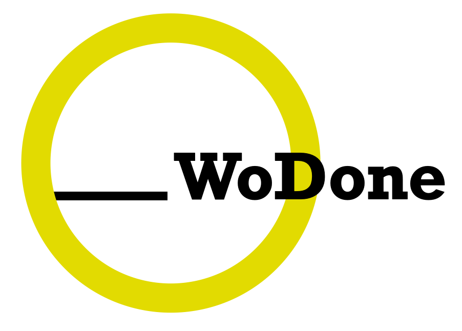
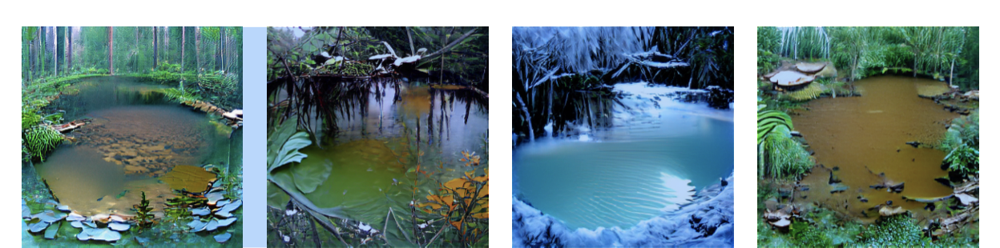
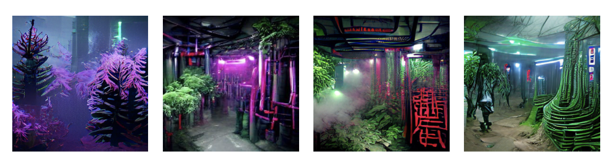
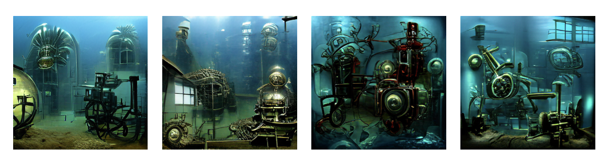
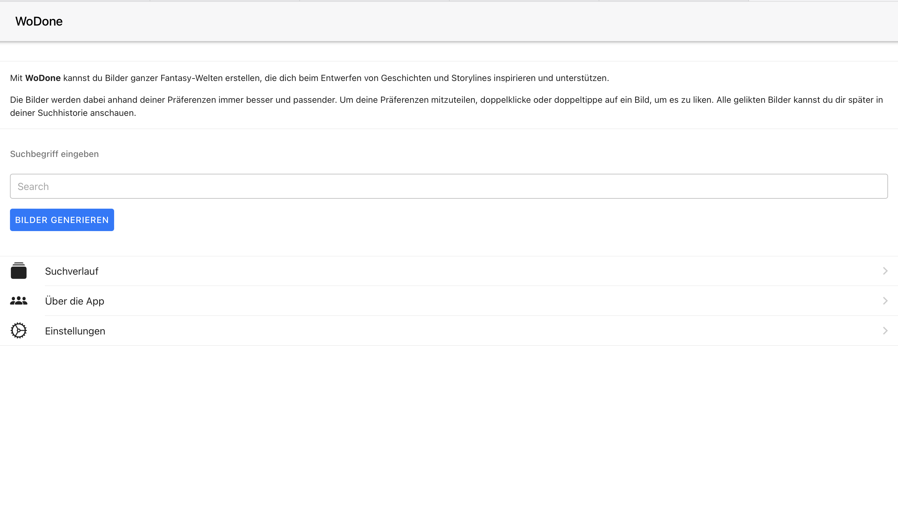
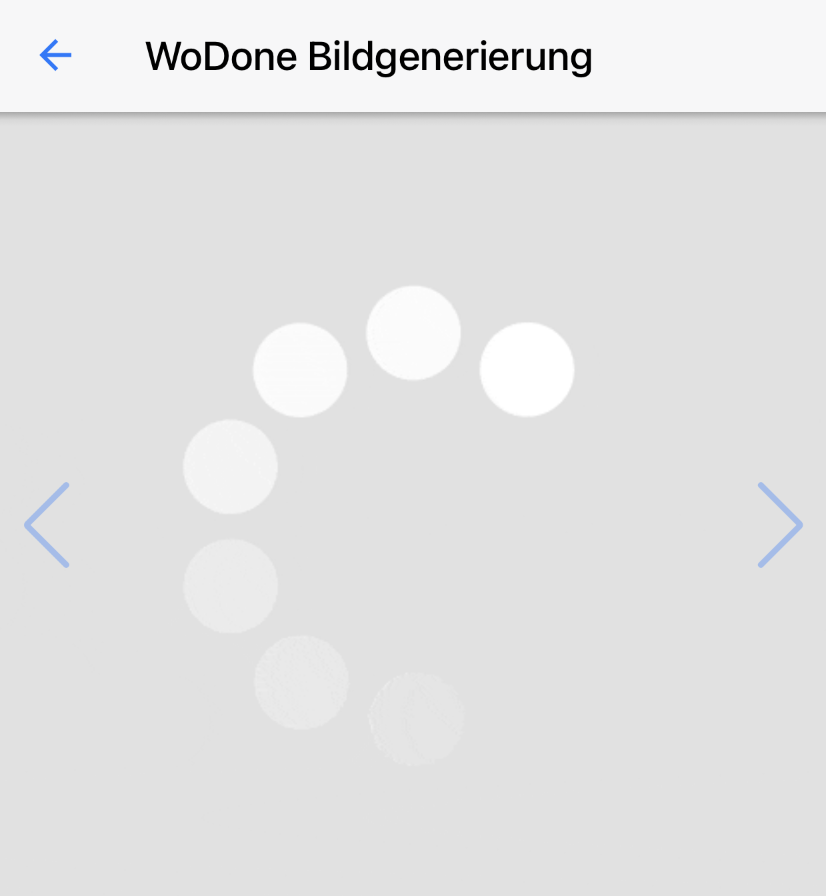
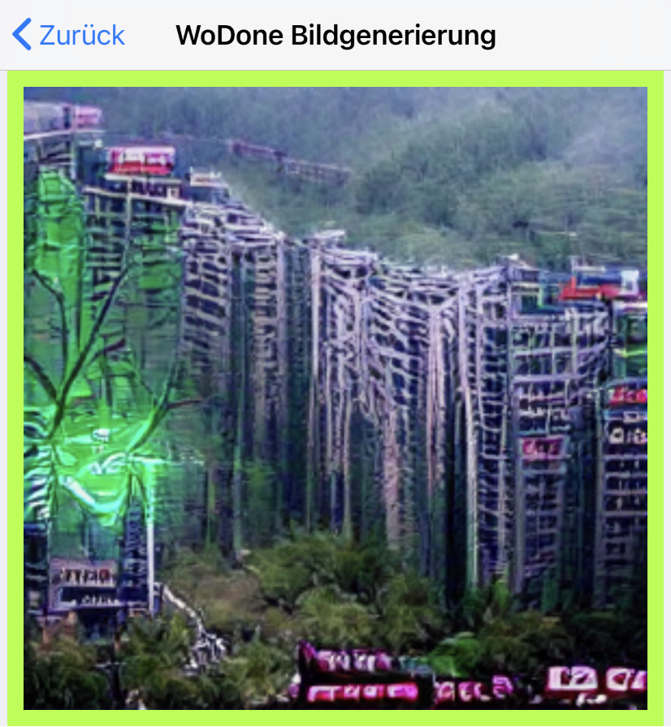
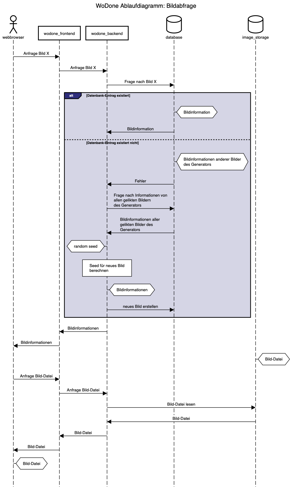

# WoDone

**AI-Based generation of exciting concept art and images by the power of your own words.**

<!-- Requirements and Installation: -->
   

# Requirements and Installation:

WoDone is divident into several microservices. Therefore one can use docker compose for the buildup. Because WoDone needs to access your GPU, we need at least **docker-compose v1.28.0+**
and
**cuda drivers** of some sort (depends on your host system).

We do highly recommend at least a Nvidia RTX 2060 (desktop) GPU to use WoDone.

To start the containers run `docker-compose up -d`

_Note: WoDone is currently only compatible with cuda-caplable Nvidia-GPUs. You can modify the docker-compose.yml in order to use CPU compute but this will slow down image generation drasticly, taking as much as an hour or more per image._

<!-- Use -->

  

# Using WoDone

After running `docker-compose up -d` WoDone will start on port `8080` on your machine. To use WoDone, connect to `http://ip.adress.of.your.machine:8080` in your webbrowser to view the GUI.

You can also integrate WoDone into your application by using the WoDone API.

## Using the GUI

The userinterface is pretty minimalistic and straightforward.
In the center search field the user inputs a deliberate number of search terms, which he wants the output theme to focus on. These could literally include any words. Popular examples are landscapes (e.g. "castle", "mountain", "space"), themes (e.g. "medieval", "bloody", "apocalyptic") or characters (e.g. "trolls", "hound"), as well as going as far as simply entering colors. By clicking on the button below the searchbar ("Bilder generieren") the user will be forwarded to the image generation page.

Past searches and their output can be viewed in the search history, just below the searchbar, which also stores already generated images as well as the users reaction to them indicating a "like" with a yellow frame. The history page works just as the main image generation page. The user can still like the images, although these changes will only be visible at the end of the already generated output queue. If this is reached the site will go on generating images depending on the past output just as the main search site does.

The About and Settings pages are self explanatory while the settings have not been completed yet, as thus far they were not necessary for the image generation to work properly. (we by the way encourage to click the link at the bottom of any 404 error page)

### Image Generation

After entering custom search terms and clicking "Bilder generieren" the user will be forwarded to the image generation page.
Here the focus lays solely on the images themselves. The uses can watch the images being generated in real time in the center of the screen.

#### Navigation

Images are portrayed on Slides. The user can navigate to the next image on the right or past images on the left either by using the scrollwheel on his mouse or the navigation arrows on the right and left of the image. The user can also simply swipe through them with his mouse or on his phone. While an image is generated this navigation is disabled. After it is done loading the next image will be generated, even if the user still remains on the first image for longer. This enables a better user experience and a seemingly smoother progress.

#### Likes

Users can like images by double-clicking on them. This triggers an animation at the respective image. Later a "like" is shown by a yellow frame around the liked image. With each like the application receives feedback about the users preferences and can therefore customize the generated concept art further and further with every iteration towards the ideal image.

 
 

## Using the API

The WoDone API is documented in the `./swagger.yaml`. It should be pretty self explainatory how to use it.

<!-- backend readme -->

  

# The technology behind it

<!-- Which neural net are we using for the image generation? -->

## How does the image generation work?

For the actual image generation we use an already pre-trained network using VQGAN + CLIP, source code for image generation taken from
https://colab.research.google.com/drive/1wkF67ThUz37T2_oPIuSwuO4e_-0vjaLs?usp=sharing#scrollTo=ZdlpRFL8UAlW (licensed under MIT license).
This is a Google Colab notebook by Max Woolf, however the original method was by Katherine Crowson.

The generative capabilities of this network are extremely impressive. The interaction of the two nets essentially consists of VQGAN generating the images, while CLIP judges how well an image matches our text input.

The Docker-container `wodone_vqgan` frequently checks the WoDone database for ungenerated images. If such are found it instructs the neural network to sequentially generate these images.

New entries of ungenerated Images are added to the database whenever a new image is requested by the user (e.g. when swiping to the next image). The process is depicted in the sequence diagram found in `./pictures/imageRequest.png`.

<!-- How does the like-algorithm work? -->

## How does the like-algorithm work?

In order for the user to have a direct impact on the image generation, some form of feedback was required.
By implementing a like algorithm, we wanted to substanciate the users idea.
If the user is given a rich pallete of styles to choose from, the fantasy world in the users mind becomes more fleshed out and concrete, even without a specific idea in mind beforehand.

For every image generated, an adjective from a set of hand-curated modificator words is added to the users search prompt.
These words have a strong stilistic impact and push the images overall appearance in a certain direction, without needing to modify the AIs code.

One benefit to this method is, that the images become more diverse. This way, the user gets more inspiration from our results.
Even if the users story isn't in any way fleshed out, our images can propose a general tone or setting for the user to choose.

Our like algorithm expands on this functionality. When the user likes an image by double tapping, the modificator word is permanently added to the search prompt. Hence, the direction the user has chosen is kept, but further explored with more modificator words.

The overall method can be visualized with a tree structure. Every branch is a different stylistic direction, and when the user likes an image, the tree is expanded from this branch on downwards.
The further down, the more specific and rich the generated images become.

All search prompts and all information about the images generated thereby (such as the modifiers and wether the image was liked or not) are stored in a database. It's entity relationship diagram is depicted in the file `./erd_from_db.pdf`.
  

# Contributing

Some usefull imformation for contributing to WoDone can be found in the `./Developers.md`.

<!-- CONTACT -->

  

# Contact us

-   Jakob Gollreiter - - jakob.gollreiter@tum.de
-   Tobias Höpp - - tobias.hoepp@tum.de
-   Bernhard Stöffler - - bernhard.stoeffler@tum.de
-   August Wittgenstein - - august.wittgenstein@tum.de
